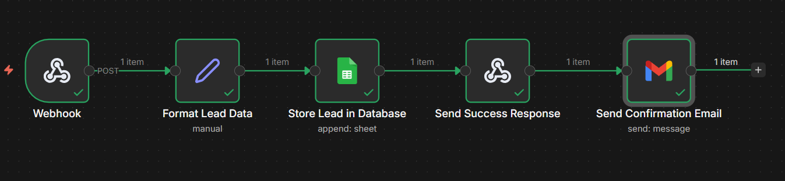
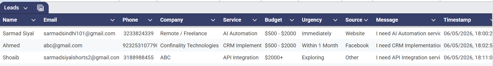
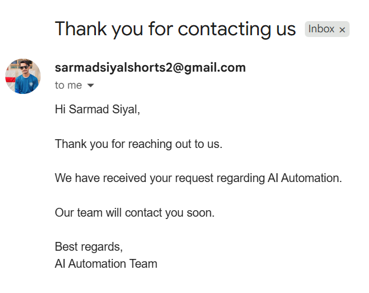

# 🚀 n8n Day 4–5: Lead Automation System

## 📌 Overview

This project demonstrates a complete **Lead Automation System** built using n8n.
It captures user data from a web-based form, stores it in a database, and sends an automated email response.

The system is designed to simulate a **real-world business lead pipeline**, focusing on simplicity, reliability, and efficiency.

---

## ⚙️ Workflow Features

* Webhook-based form submission
* Structured data processing
* Automatic storage in Google Sheets
* Automated email confirmation
* Clean and efficient workflow design

---

## 🔄 Workflow Architecture

Form Submission → n8n Webhook → Data Processing → Google Sheets → Success Response → Email Automation

---

## 🧩 Workflow Preview

---

## 📊 Database (Google Sheets)

All incoming leads are stored in Google Sheets with structured fields for easy tracking and management.

### Stored Fields:

* Name
* Email
* Phone
* Company
* Service
* Budget
* Urgency
* Source
* Message
* Timestamp

---

## 📧 Email Automation

After submission, each lead receives an automatic confirmation email.

### Email Features:

* Personalized message
* Service-based context
* Professional formatting

---

## 🧠 Design Approach

This workflow is designed with a focus on:

* Simplicity (minimal nodes, clear structure)
* Reliability (consistent execution)
* Real-world usability (business-ready system)

No unnecessary complexity or overengineering is introduced.

---

## 🛠️ Tools & Technologies

* n8n (Workflow Automation)
* Webhooks
* Google Sheets (Database)
* Gmail (Email Automation)
* HTML Form (Frontend Lead Capture)

---

## 📂 How to Use

1. Import the workflow from `workflows/lead-automation.json`
2. Configure Google Sheets credentials
3. Configure Gmail credentials
4. Replace webhook URL in the HTML form
5. Activate the workflow
6. Submit form to test automation

---

## 🎥 Demo Video

Watch the complete demonstration here:

[[Add your video link here](https://www.loom.com/share/458f3490b94a469c8980956f09b8773a)]

---

## 👤 Author

Sarmad Siyal

---

## 📌 Notes

This project is part of the AI Automation Internship probation tasks (Day 4–5).

Credentials are not included in this workflow. Please configure your own Google Sheets and Gmail credentials before running.
